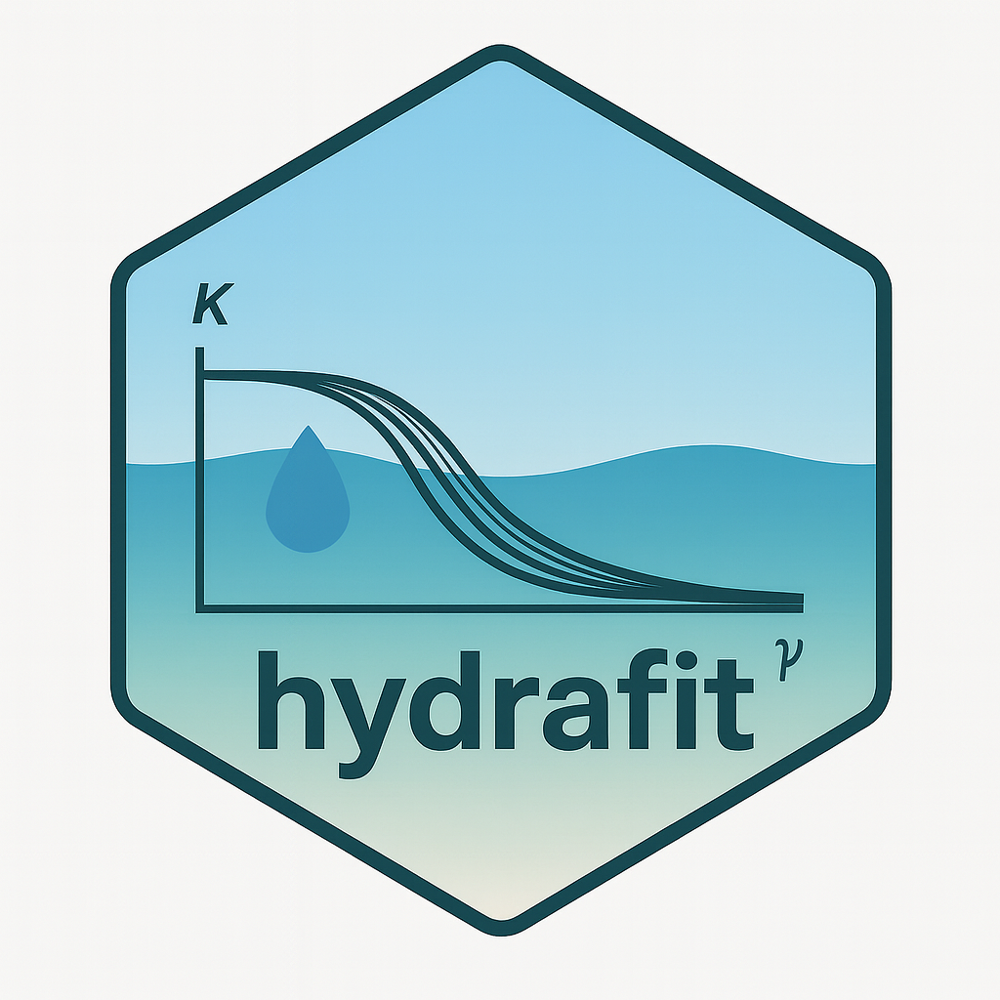

<!-- README.md is generated from README.Rmd. Please edit that file -->

```{r, include = FALSE}
knitr::opts_chunk$set(
  collapse = TRUE,
  comment = "#>",
  fig.path = "man/figures/",
  out.width = "100%"
)
```

# hydrafit 

<!-- badges: start -->

[](https://lifecycle.r-lib.org/articles/stages.html#stable)
[](https://app.codecov.io/gh/brownegm/hydrafit)
<!-- badges: end -->

## Fit hydraulic vulnerability curves and bootstrap hydraulic thresholds

The goal of hydrafit is to fit line parameters using a likelihood frame work for leaf hydraulic vulnerability curves. The functions included in the tests of the best fit are:

-   linear

<!-- -->

-   logistic

-   sigmoidal

-   and two exponential functions

See `?hydrafit::Linear()` for all fitted functions.

This package also supports for the bootstrapping percent loss in hydraulic function as well as pairwise bootstrap comparisons. For more information on bootstrapping see `?hydrafit::bootPX`.

## Installation

You can install the development version of hydrafit from [GitHub](https://github.com/) with:

```{r eval=FALSE}
devtools::install_github("brownegm/hydrafit", build_vignettes = T)
```

## Examples

An example of the use of the functions is available as a vignette.

```{r eval=FALSE}
browseVignettes(package = "hydrafit")
```

The unrendered vignette is also available in vignettes folder as a .qmd file.
